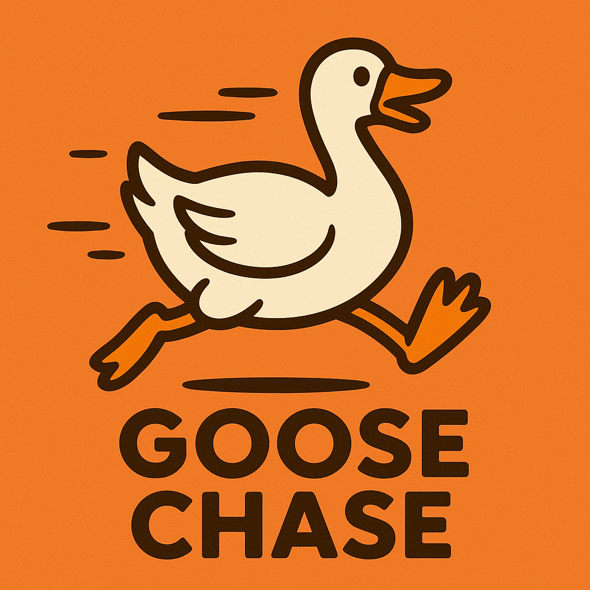
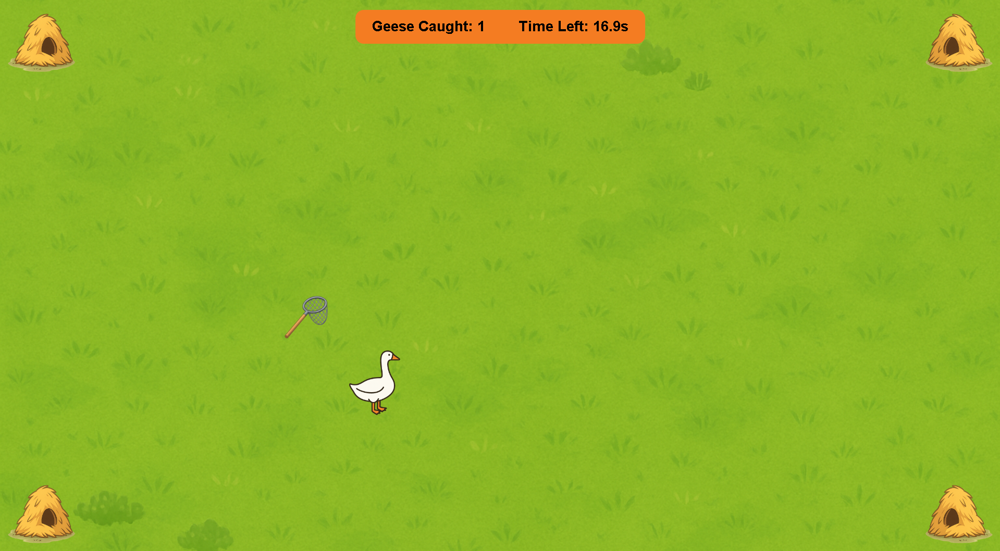

<p align="center">
    
</p>

## Description

GooseChase is a fun and chaotic browser game where you try to catch a goose with your net. The goose runs away when you get too close, making it harder than it looks. Be fast, smart and lucky to catch as many geese as possible before the time runs out.

## Play Online

A live version is hosted here:

[GitHub Pages Demo Link](https://feldherrweiprecht.github.io/GooseChase/)

## How It Works

1. Shows a start screen with instructions and a start button.
2. Uses a custom cursor that looks like a net.
3. Spawns a goose at a safe distance from the cursor.
4. The goose runs away when the net gets too close.
5. Push the goose into a corner to catch it.
6. Shows score and remaining time during gameplay.
7. Displays an end screen with final score and restart button.

## Requirements

GooseChase runs in the browser and doesn't require any installation. To play or develop:

- Any modern browser like `Chrome`, `Edge`, `Firefox` or `Safari`.
- Local web server (recommended for testing).

## Usage

You can either:

- Open `index.html` directly in your browser (for a quick test). 
- Or use a local web server (recommended) for full functionality.

To start a local web server using `Python`, run this command in the terminal:

```bash
python -m http.server
```

Then open [http://localhost:8000](http://localhost:8000) in your browser.

Alternatively if you are using VS Code, you can use the `Live Server` extension to launch the game.

## Files

- `index.html` – Game layout and screens.
- `style.css` – Styling and layout.
- `script.js` – Game logic.
- `assets/` – Contains all sprites (background, goose, net, etc.)

## Example


